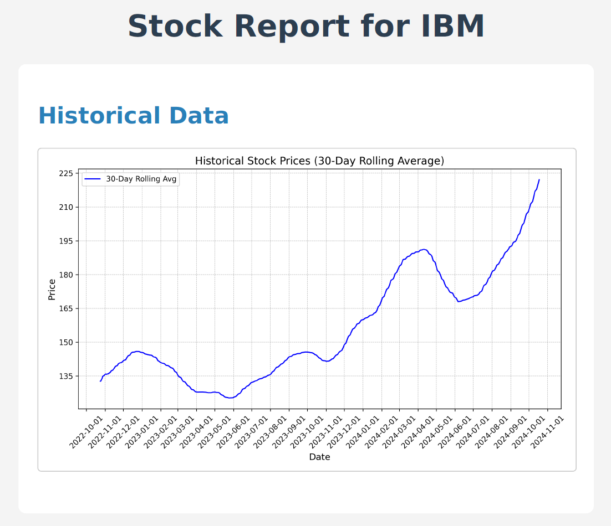
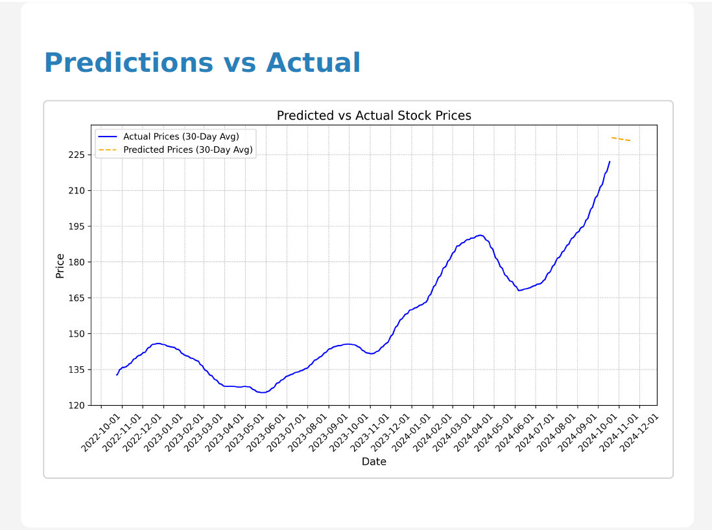
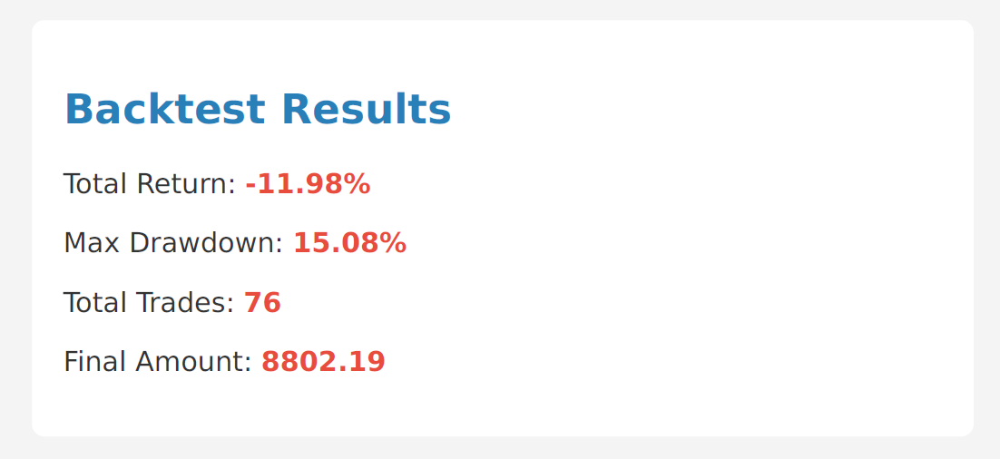

# StockWise API - README

Welcome to **StockWise API**, a Django-based application for stock price predictions, backtesting strategies, and generating financial reports.





**StockWise** is a stock analysis tool that provides historical data on stock prices, predictions using machine learning models, and backtests strategies to help make informed investment decisions.

## Features

- Fetch historical stock data using Alpha Vantage API.
- Predict stock prices using machine learning models.
- Backtest strategies using moving averages.
- Generate PDF reports comparing historical and predicted stock prices.

---

## Prerequisites

Ensure you have the following installed on your machine:

1. **Python 3.10+**
2. **Docker** (for containerized deployment)
3. **Alpha Vantage API Key** - You'll need to sign up for a free API key at [Alpha Vantage](https://www.alphavantage.co/support/#api-key) to fetch stock data.

---

## Setup Instructions

### Clone the Repository

First, clone the repository to your local machine:

```bash
git clone https://github.com/parthsolanke/stockwise.git
cd stockwise
```

### Create a Virtual Environment

Create a Python virtual environment and activate it:

```bash
# For Linux/macOS
python3 -m venv venv
source venv/bin/activate

# For Windows
python -m venv venv
venv\Scripts\activate
```

### Install Dependencies

With the virtual environment activated, install all the required dependencies:

```bash
pip install -r requirements.txt
```

### Set up Environment Variables

You will need to create a `.env` file in the root of your project with the following content:

```bash
DEBUG=value
DJANGO_SECRET_KEY=value
DJANGO_ALLOWED_HOSTS=value
ALPHA_VANTAGE_API_KEY=value
API_BASE_URL=value
DB_NAME=value
DB_USER=value
DB_PASSWORD=value
DB_HOST=value
DB_PORT=value
REDIS_URL=value
```

> **Note:** Replace `value` with your actual values.

### Run Migrations

Run the following commands to make the necessary database migrations and migrate:

```bash
python manage.py makemigrations core
python manage.py migrate
```

## Running the Application

### Running Locally

To run the application locally, use the following command:

```bash
python manage.py runserver
```

The application will be available at: `http://127.0.0.1:8000/`

### Running with Docker

If you prefer to run the application using Docker, follow these steps:

1. **Build the Docker Image**:

   In the root of your project directory, run:

   ```bash
   docker build -t stockwise .
   ```

2. **Run the Docker Container**:

   Once the image is built, you can run it with the following command:

   ```bash
   docker run -p 8000:8000 --env-file .env stockwise
   ```

This will start the app in a Docker container, making it accessible at `http://localhost:8000/`.

---

## Endpoints

Refer to API [doc](public/API.md)

---

## Deployment

To deploy this project, follow these steps:

### Docker Deployment

1. **Build the Docker Image**:

   Run the following command to build the Docker image:

   ```bash
   docker build -t stockwise .
   ```

2. **Run the Container**:

   Run the Docker container on your server using:

   ```bash
   docker run -d -p 8000:8000 --env-file .env stockwise
   ```

   The application will now be live on `http://your-server-ip:8000`.

## Troubleshooting

- **Database errors**: Ensure you've run migrations and seeded data before accessing the API.
- **Docker build issues**: Make sure you have the latest version of Docker installed and your `.env` file is properly configured.
- **API Key issues**: Ensure your Alpha Vantage API key is valid and correctly stored in the `.env` file.